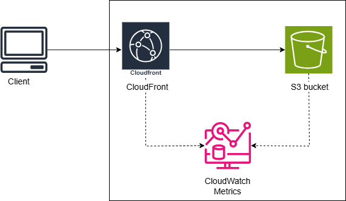

# static-web-page
Using S3 to host a static personal website.

## Functional requirements.
 - Ability to create, edit, and update the content of the CV, including sections for personal information, education, work experience,
skills, and projects
 - Support for non-text content such as images.
 - Accessible on any browser over the internet
 - Ability to generate insights based on website data.

## Non-functional requirements.
 - Low latency – fast page load times
 - High availability – available when accessed
 - Ease of maintainability – easy process to update, and patch the website.
 - Low cost – cheap pay-as-you-go services.

 ## Architecture
The following diagram provides a visual representation of the services used in this project and how they are connected. This application uses CloudFront, S3 and CloudWatch metrics.

